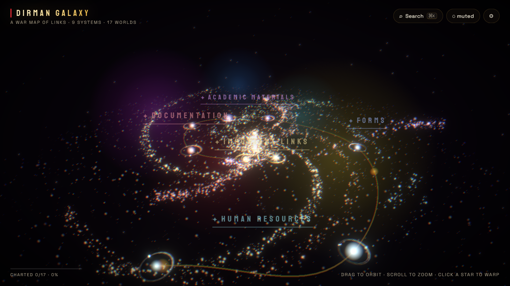

# Dirman Galaxy

<div align="center">

**A war map of links — an immersive 3D universe where every star is a real link.**

[](https://github.com/gigahidjrikaaa/dirman-verse/actions/workflows/ci.yml)
[](LICENSE)



</div>

Warp through a procedurally generated galaxy — nine character tails radiate
from a gunungan core, a golden route threads every solar system, and each of
the nine clusters carries its own shade along the march. Every sun, planet
and moon is a real link: click a star, watch the warp flight, open the page.

Built with **React Three Fiber + Vite + TypeScript**. No backend, no
database, no asset files — the galaxy, its textures and even the ambient
audio are generated procedurally.

## Features

- **The long march** — systems are strung along a single winding, climbing
  route instead of a flat pinwheel; the golden *Jalur Perjuangan* tube threads
  every sun with ember pulses traveling it
- **Nine character tails** — one spiral tail per leadership value of the
  Sudirman batch (integrity, communication, courage…), each with its own
  shade and motion signature
- **Unique stars** — every link is a different celestial body: banded gas
  giants, ringed worlds, lava veins, ice caps, cratered rock, twin suns,
  pulsars — procedurally hashed from each link's id
- **Cinematic navigation** — damped orbit, click-to-warp flights with FOV
  punch, a free-flight mode, arrival glides and an intro sweep from the
  loading map
- **War-room boot sequence** — a 2D radar map of the real layout pings each
  system in, draws the march route, then dives into the 3D scene
- **List-based search** — ⌘/Ctrl+K opens every destination grouped by
  cluster; type to filter, arrows to choose, Enter to warp
- **Discovery** — visited stars stay charted with a golden ring; the HUD
  tracks how much of the galaxy you've explored
- **In-app link manager** — add, edit, reorder and delete links at `#/config`
  without touching code; saved in the browser, exportable as JSON
- **Accessible & light** — keyboard navigation, screen-reader announcements,
  reduced-motion mode, no-WebGL fallback, adaptive quality with a device
  tier at boot and a performance governor that steps resolution, particles
  and bloom down when the frame budget is missed

## Quick start

```bash
npm install
npm run dev      # local dev server
npm run build    # typecheck + static production build in dist/
npm run preview  # serve the production build locally
```

Deploy `dist/` to any static host (Vercel, Netlify, GitHub Pages) — `base`
is already relative, so subpath hosting works.

## Controls

| Input | Action |
|---|---|
| Drag | orbit the galaxy (look around in free-fly) |
| Scroll / pinch | zoom |
| Hover | identify a star |
| Click a star | cinematic warp → info card |
| Click the same star again | open its link |
| Click empty space / `Esc` | return to the overview |
| `←` / `→` | cycle through every body |
| `Enter` | open the selected body's link |
| `⌘/Ctrl + K` or `/` | list-based destination search |
| `F` | free-flight mode (`WASD` thrust, `Shift` boost) |
| `M` | ambient sound on/off |

Any star can be shared: the URL carries `?focus=<id>` as you travel, and the
info card's **Share star** button copies it.

## Managing links without code

Open **`#/config`** (or ⚙ Flight settings → Link manager) to add, edit,
reorder and delete clusters, systems and links through forms — including each
star's archetype (`style`) and hue shift (`tint`). Saving stores the dataset
in your browser's localStorage and the galaxy boots from it; **Reset to
defaults** restores the built-in dataset.

To publish changes for every visitor, use the JSON tab's **Download** and
replace the `sectors` array in `src/data/links.ts`.

## Adding your links in code

The dataset lives in `src/data/links.ts` (defaults) — clusters become
stretches of the march, systems become suns, bodies become links:

```ts
{
  id: 'important',
  name: 'Important Links',       // the first cluster sits at the core
  hue: 46,                       // tints the whole cluster (0–360)
  systems: [{
    id: 'command',
    name: 'Command Hub',
    importance: 3,               // 1–3: sun size + ★ rank stars
    bodies: [
      { id: 'main-site', name: 'Main Site', url: 'https://…' },
      { id: 'dashboard', name: 'Dashboard', url: '…', kind: 'moon' },
    ],
  }],
}
```

**Unique stars:** every link also gets a stable, automatic look — a celestial
archetype plus a procedural seed hashed from its id, so no two stars render
alike and edits to other entries never reshuffle them.

- Suns: `classic` · `giant` · `flame` · `pulse` · `binary`
- Planets: `terran` · `gas` · `ice` · `lava` · `ringed` · `rock`

Pin a star's look explicitly with `style: 'ringed'` and shift its hue with
`tint: -18` (−40..40). Omit both to keep the automatic hash.

## Architecture

```
src/
  data/
    links.ts           ← link dataset (defaults) + deterministic layout engine
    galaxyData.ts      types, built-in defaults, localStorage persistence
    characters.ts      the nine character tails (names, shades, shape DNA)
    starStyles.ts      celestial archetypes + per-id hashing
  state/useGalaxy.ts   zustand store (mode, selection, discovery, quality)
  three/
    Scene.tsx          scene assembly
    GalaxyBackdrop.tsx braided-tail particle backdrop (one draw call)
    LinkBodies.tsx     instanced star layer + screen-space picking
    Systems.tsx        merged orbit-ring shader lines
    MarchRoute.tsx     the golden route tube + ember pulses
    SectorLabels.tsx   floating cluster names
    CameraRig.tsx      orbit / warp / focus / free-fly camera machine
    Comet.tsx          easter egg — catch it for a hidden link
    Effects.tsx        bloom + vignette + warp chromatic aberration
    shaders/           GLSL (galaxy, stars, orbit rings)
  ui/                  HUD, info card, palette, settings, preloader,
                       link manager (#/config), no-WebGL fallback
  hooks/               adaptive quality governor, keyboard, deep links
  audio/audio.ts       procedural WebAudio drone + SFX
```

### Performance

All link bodies render in one instanced draw call; picking is screen-space;
the per-frame loop is allocation-free. Devices boot at a quality tier matched
to their hardware (phones and software renderers start at low), and an
adaptive governor escalates downward when the frame budget is missed:
particle tier → DPR multiplier steps → bloom off. Orbit rings merge into a
single draw call and all motion lives in shaders. `prefers-reduced-motion`
freezes drift/warp/twinkle, and the site collapses to a plain link list when
WebGL is missing.

## Design notes

The visual language honors **Jenderal Sudirman**, the general "Dirman" is
named after: brass-gold *bintang* rank stars on important systems, revolution
red-and-white accents, wayang-style gold-on-dark orbit lines, a batik parang
strip on the info card — and the nine tails carrying the batch's core
character values.

## Prior art

[100,000 Stars](https://research.google.com/100000stars/) (Google Creative
Lab), [Bruno Simon's portfolio](https://bruno-simon.com) and
[Three.js Journey](https://threejs-journey.com) (galaxy generator
technique), [NASA Hubble Skymap](https://science.nasa.gov/mission/hubble/multimedia/online-activities/hubble-skymap).

## License

[MIT](LICENSE) © Giga Hidjrika Aura Adkhy
